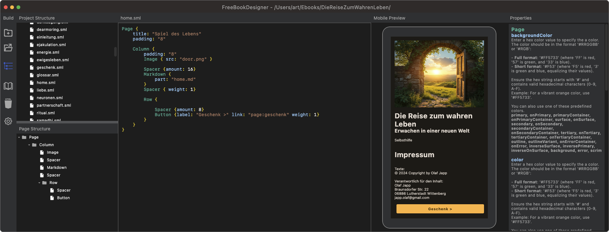
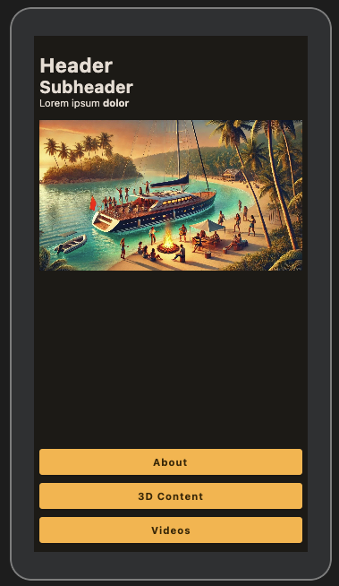

# FreeBookDesigner  

  

## Status   
Actively Maintained   
FreeBookDesigner is now fully based on Jetpack Compose and actively developed for creating and managing books using a modern, feature-rich interface.   

---
## About FreeBookDesigner

FreeBookDesigner is a versatile tool for crafting books with precision and creativity. It employs SML (Simple Markup Language) to define book layouts, properties, and content structure in a highly flexible way.

**Features**  
• Compose-Based Interface: Built with Jetpack Compose for a dynamic and responsive user experience.  
• SML Grammar Support: Design layouts and define content using a custom grammar inspired by QML.  
• Integration with FreeBookReader: Seamless compatibility with the FreeBookReader app for rendering SML content.  
• Rich Media Support: Work with text, images, videos, sounds, and even 3D objects with animations.  
• Future-Proof Storage: Support for hosting content on GitHub Pages and IPFS for decentralized and resilient storage.  

---

## Installation

Follow these steps to set up the project locally:
1. Clone the repository:  
```
git clone https://github.com/CrowdWare/FreeBookDesigner.git  
cd FreeBookDesigner  
```

2. Open the project in your preferred IDE (recommended: IntelliJ IDEA).
3. Build and run the project using Gradle.

```
./gradlew build
./gradlew run
```  

Building a DMG file is a bit problematic atm. Dont know why ;-)  
Also I dont have a Windows or Linux Machine right now. 
Maybe you know how and want to contribute...  
...your welcome.

---


# SML Grammar

FreeBookDesigner uses a custom grammar called SML (Simple Markup Language) for book layouts. Below is an example of the grammar definition:  
```
// Tokens  
TOKEN identifier: "[a-zA-Z_][a-zA-Z0-9_]*"  
TOKEN lBrace: "{"  
TOKEN rBrace: "}"  
TOKEN colon: ":"  
TOKEN stringLiteral: "\"[^\"]*\""  
TOKEN whitespace: "\\s+"  
TOKEN integerLiteral: "\\d+"  
TOKEN floatLiteral: "\\d+\\.\\d+"  
TOKEN lineComment: "//.*"  
TOKEN blockComment: "/\\*[\\s\\S]*?\\*/"  

// Grammar Rules  
Grammar SmlGrammar {  

    // Whitespace and comments are ignored  
    ignored: whitespace | lineComment | blockComment  

    // Property Value Types  
    stringValue: stringLiteral -> PropertyValue.StringValue(value)  
    intValue: integerLiteral -> PropertyValue.IntValue(value.toInt())  
    floatValue: floatLiteral -> PropertyValue.FloatValue(value.toFloat())  

    // Define Property Value  
    propertyValue: floatValue | intValue | stringValue  

    // Define a Property  
    property: ignored* identifier ignored* colon ignored* propertyValue -> (id, value)  

    // Element Content can contain properties or nested elements  
    elementContent: (property | element)*  

    // Define an Element  
    element: ignored* identifier ignored* lBrace elementContent ignored* rBrace  

    // Root Parser for the entire structure  
    root: (element+ ignored*) -> elements  
}
```
# SML Example

The following is a sample written in Simple Markup Language (SML), designed to layout and describe the contents of a page. The SML syntax is straightforward and compact, allowing developers to define UI elements and their properties with ease.  
```qml
Page {
    title: "Home"
    padding: "8"

    Column {
        Markdown {
            text: "
                # Header
                ## Subheader
                Lorem ipsum **dolor** "
        }
        Spacer { amount: 16 }
        Image { src: "ship.png" }
    }
    Spacer { weight: 1 }
    Button { label: "About" link: "page:about" }
    Button { label: "3D Content" link: "page:scenes" }
    Button { label: "Videos" link: "page:video" }    
}
```
## Explanation of the Components

• **Page**:  
Defines the structure of a single page in the application.  
•	title: The title of the page.  
•	padding: Sets the padding around the page’s content.  

•	**Column**:  
Arranges child elements vertically. Useful for creating stacked layouts.  

•	**Markdown**:  
Allows the use of Markdown syntax for styled text.  
•	text: Contains the Markdown content. In this example:  
•	# Header creates a large heading.  
•	## Subheader creates a subheading.  
•	Lorem ipsum **dolor** displays normal text, with “dolor” in bold.  

•	**Spacer**:  
Adds space between elements.  
•	amount: Specifies the size of the spacer (in pixels).  
•	weight: Used for flexible spacing, like pushing elements to opposite sides of the screen. 

•	**Image**:  
Embeds an image into the layout.  
•	src: The file path or URL to the image resource.  

•	**Button**:  
Adds a clickable button to the UI.  
•	label: The text displayed on the button.  
•	link: The action triggered by the button, such as navigating to another page.  

## Rendered Result


This SML describes a simple Home Page with:  
1.	A title and some text formatted with Markdown.  
2.	An image.  
3.	A few buttons leading to other pages (“About,” “3D Content,” and “Videos”).  
4.	Spacing elements for better layout and visual separation.  

This structure highlights how SML can be used to define content-rich, visually appealing layouts in a concise and human-readable way.  

## Use Cases for SML

1.	Book Layouts: Define headers, footers, paragraphs, and custom styles.  
2.	Interactive Content: Specify embedded media like images, sounds, or 3D objects.  
3.	Dynamic Styling: Leverage properties to apply reusable styles.  

---

## Related Projects  
•	[FreeBookReader](https://github.com/CrowdWare/FreeBookReader):  
An open-source Compose Android app that renders SML-based content. It allows seamless viewing of books stored on GitHub Pages or pinned to IPFS.  
•	Highlights:  
•	Single, consistent browser for SML content.  
•	Support for decentralized and open technologies.  
•	Elimination of traditional browser inconsistencies.  
•	Future Directions:  
We envision SML as a key step in internet technology, enabling cross-platform content rendering without relying on diverse and often conflicting HTML browsers.  

---

# Contributing

Contributions are welcome! Here’s how you can contribute:  
1.	Fork the repository.  
2.	Create a new branch for your feature or bugfix.  
3.	Submit a pull request with detailed information about your changes.  
---

# Previous Versions

This project originated as a fork from earlier projects and has since evolved significantly.
1.	JavaFX-Based Implementation
The original version of this project was built with JavaFX and is now deprecated.
•	For archival purposes, visit: [BookDesigner](https://github.com/CrowdWare/BookDesigner)
2.	Base Project: FreeBookDesigner
FreeBookDesigner was initially split from the FreeBookDesigner project.
•	FreeBookDesigner aims to be a versatile tool for creating mobile apps without requiring any coding knowledge.
•	It will be maintained and released later as a standalone product.
•	Learn more: [FreeBookDesigner](https://github.com/CrowdWare/FreeBookDesigner)

